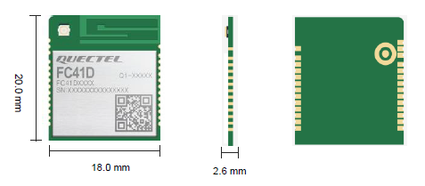

# Quectel FC41D Module Overview

This document provides a quick reference for developers using the **Quectel FC41D** Wi‑Fi/Bluetooth module.  The FC41D is a compact, low‑cost module built around the BK7231MD chipset.  It integrates a 120 MHz ARM968 core, **256 KB RAM** and **2 MB/4 MB flash**【311191526242340†L8-L20】【311191526242340†L74-L79】.  The module supports **IEEE 802.11b/g/n (Wi‑Fi 4)** and **Bluetooth 5.2** for dual‑mode wireless connectivity and complies with WPA‑PSK, WPA2‑PSK and **WPA3‑SAE** security standards【311191526242340†L27-L33】【311191526242340†L69-L70】.  Its compact 20 × 18 mm land‑grid (LCC) package and integrated RF front‑end simplify product design and reduce cost.

## Key features

- **Processor and memory:** 120 MHz ARM968 core with 256 KB RAM and 2 MB/4 MB flash【311191526242340†L8-L20】【311191526242340†L74-L79】.
- **Wireless:** Single‑band 2.4 GHz Wi‑Fi (IEEE 802.11b/g/n) with up to 72 Mbps and Bluetooth 5.2 LE【311191526242340†L27-L33】.
- **Security:** Supports WPA‑PSK, WPA2‑PSK and WPA3‑SAE encryption modes【311191526242340†L27-L33】【311191526242340†L69-L70】.
- **Interfaces:** Up to 19 GPIOs with UART, SPI, I²C, PWM and ADC functions available【311191526242340†L27-L33】.  Interfaces operate on a 3.3 V domain.
- **Operating range:** –40 °C to +85 °C operating temperature with low‑power modes for energy‑efficient applications【311191526242340†L82-L85】.
- **Form factor:** LCC package measuring 20 mm × 18 mm × 2.6 mm【311191526242340†L74-L79】.  The FC41DAEMD ordering code used in this project provides an external antenna pin.

## Pin summary

The FC41D exposes a 27‑pin LCC footprint.  Major pins and their functions (according to the QuecOpen hardware design guide【509320332217014†L915-L1018】) are summarised below.  All unused pins should be left floating; all GND pins must be connected to ground【509320332217014†L875-L880】.

| Pin | Name      | I/O | Description |
|----:|-----------|:---:|-------------|
| 1, 3, 16, 27 | **GND** | — | Ground pins; connect all to board ground【509320332217014†L875-L880】. |
| 15 | **VBAT** | PI | Main power supply (3.0–3.6 V, typ. 3.3 V). Provide at least 0.3 A current for Wi‑Fi transmissions【509320332217014†L915-L928】. |
| 9 | **CEN** | DI | Hardware reset (active low); pulling low resets the module【509320332217014†L939-L949】. |
| 19 | **MAIN_RXD** | DI | Main UART receive (3.3 V)【509320332217014†L950-L972】. |
| 20 | **MAIN_TXD** | DO | Main UART transmit (3.3 V)【509320332217014†L950-L972】. |
| 25 | **DBG_RXD** | DI | Debug UART receive (test point)【509320332217014†L970-L985】. |
| 26 | **DBG_TXD** | DO | Debug UART transmit (test point)【509320332217014†L970-L985】. |
| 13 | **SPI_MISO** | DIO | SPI master‑in/slave‑out (3.3 V)【509320332217014†L987-L1000】. |
| 14 | **SPI_MOSI** | DIO | SPI master‑out/slave‑in (3.3 V)【509320332217014†L987-L1004】. |
| 17 | **SPI_CLK** | DIO | SPI clock; output in master mode, input in slave mode【509320332217014†L987-L1013】. |
| 18 | **SPI_CS** | DIO | SPI chip select; output in master mode, input in slave mode【509320332217014†L1014-L1021】. |
| 4 | **I2C_SCL** | OD | I²C clock; requires external pull‑up to 3.3 V【509320332217014†L1023-L1035】. |
| 5 | **I2C_SDA** | OD | I²C data line【509320332217014†L1023-L1037】. |
| 7 | **WAKEUP_IN** | DI | Host signal to wake the module from deep sleep (rising‑edge triggered)【509320332217014†L1041-L1055】. |
| 8 | **WAKEUP_OUT** | DO | Module signal to wake the host (active high)【509320332217014†L1057-L1062】. |
| 12 | **NET_STATUS** | DO | Indicates network connection status; outputs high when Wi‑Fi is connected in STA mode【509320332217014†L1067-L1084】. |
| 11 | **PWM** | DO | PWM output channel【509320332217014†L1085-L1096】. |
| 10 | **GPIO1** | DIO | General‑purpose I/O; can be configured as interrupt wakeup【509320332217014†L1098-L1112】. |
| 22 | **GPIO2** | DIO | General‑purpose I/O【509320332217014†L1098-L1116】. |
| 23 | **GPIO3** | DIO | General‑purpose I/O【509320332217014†L1098-L1116】. |

Additional pins provide ADC, PWM and antenna connections; refer to the **FC41D QuecOpen Hardware Design** document for full details.

## Module image

Below is a simplified illustration of the FC41D module.  The actual module is a land‑grid array package with contacts on all four sides.  This image may help visualise the module footprint for PCB design.

## Specification document

The complete **Quectel FC41D Wi‑Fi/Bluetooth Specification (V2.2)** is included in this repository as a reference.  See [docs/Quectel_FC41D_Wi‑FiBluetooth_Specification_V2.2.pdf](Quectel_FC41D_Wi%E2%80%91FiBluetooth_Specification_V2.2.pdf) for detailed electrical characteristics, radio performance and regulatory information.
